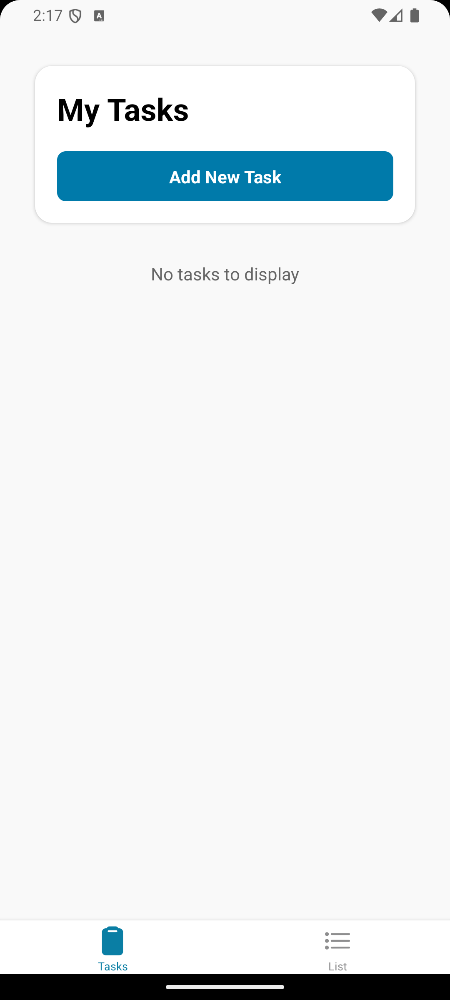
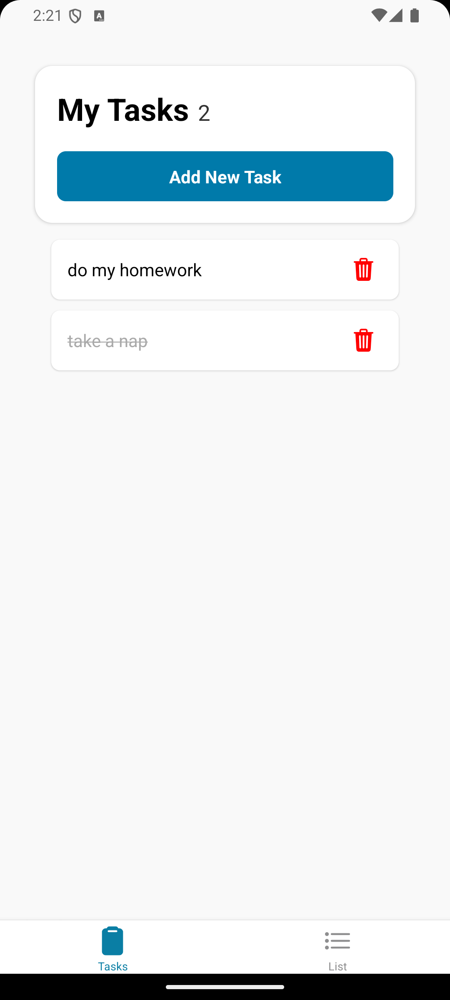
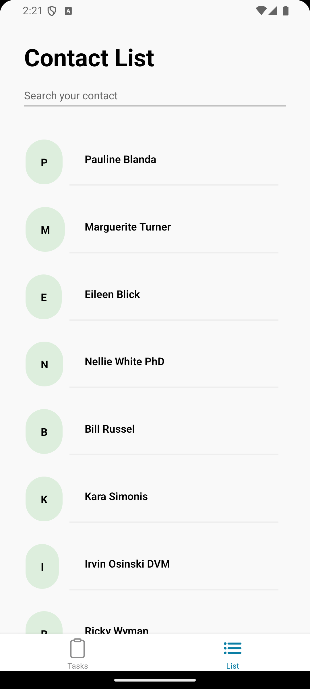
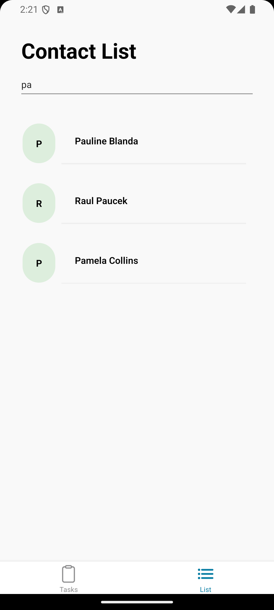

# Welcome to React Native Challenge app 👋

## Table of contents

- [Overview](#overview)
  - [The challenge](#the-challenge)
  - [Screenshot](#screenshot)
- [Setup](#setup)
  - [Built with](#built-with)
  - [How to setup](#how-to-setup)
- [Author](#author)


## Overview 

### The Challenge

Users should be able to:

> This project is a simple React Native mobile application focused on task management and data fetching capabilities. The app features a dual-section structure with a main navigation screen containing two primary buttons. The first section implements a basic task management system where users can view and add tasks with descriptions. The second section demonstrates data fetching functionality by retrieving and displaying a list of items from a remote API endpoint. 

### Screenshot

> Android View
> 
> 
> 
> 


## Setup
### Built with

- [Expo](https://docs.expo.dev/) with Typescript as React Native framework.
 - [Redux](https://redux.js.org/) as global state managment.


## How to setup

### Clone repository

```
https://github.com/Lenugo/expo-tasks-challenge
```

### Install dependencies
```
npm install
```

### Compiles and hot-reloads for development
```
npm run start
```

## Author

- Github User - [Lenugo](https://www.github.com/Lenugo)
- LinkedIn - [Lenugo](https://www.linkedin.com/in/Lenugo)
